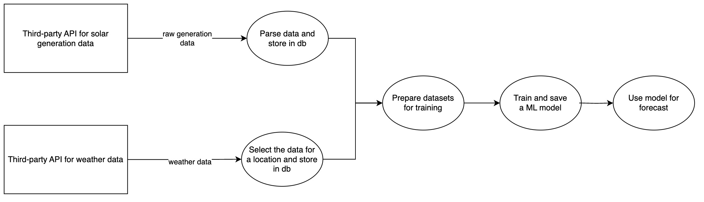

# Solar Generation Forecasting App

## Overview
This application collects solar generation and weather data from third-party APIs, processes and stores the data, prepares datasets for training, trains a machine learning model, and uses the trained model for forecasting.

## Workflow

1. **Data Collection**
   - Fetch solar generation data from a third-party API.
   - Fetch weather data from a third-party API.

2. **Data Processing**
   - Parse the raw solar generation data and store it in the database.
   - Select weather data relevant to a specific location and store it in the database.

3. **Dataset Preparation**
   - Combine and prepare datasets for training the ML model.

4. **Model Training**
   - Train a machine learning model using the prepared dataset.
   - Save the trained model for future use.

5. **Forecasting**
   - Use the trained model to forecast solar generation.

## Technologies Used
- Python
- Machine Learning (scikit-learn, Keras)
- Django
- PostgreSQL
- Requests
- Pandas

## Future Improvements
- Enhance data preprocessing steps.
- Optimize the ML model for better accuracy.
- Deploy the model as an API service.
- Integrate real-time forecasting capabilities.

## License
This project is open-source under the MIT License.

